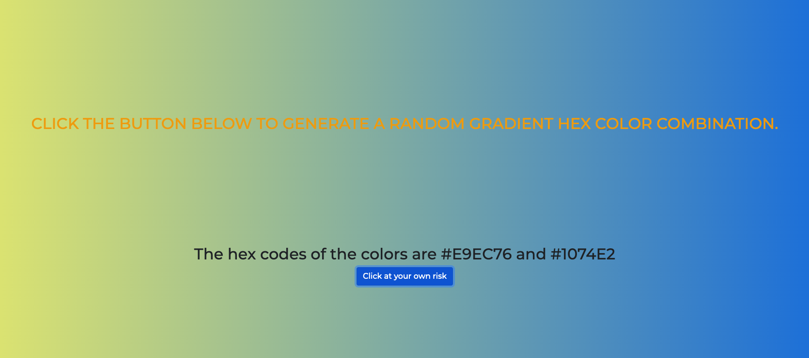

# Random Gradient Generator

### This is a fun little practice project to generate random background hex color gradients, and then display the hex codes on the screen, so you know which colors you're seeing.

I used JavaScript, HTML/CSS, Bootstrap and DOM manipulation for this mini-project.

